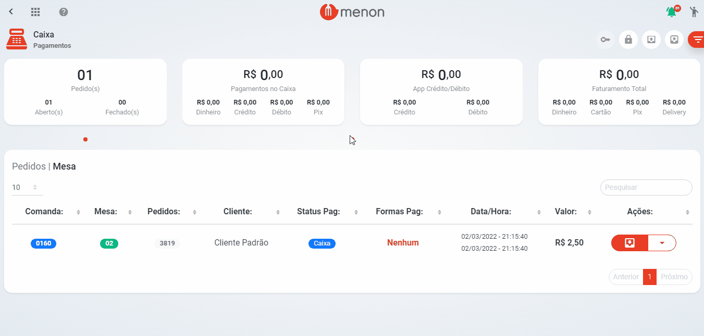

# Pagamento


Para realizar o pagamento, é necessário que o pedido seja enviado ao **caixa**, vide (link).


* No **caixa**, encontre o pedido desejado e clique no botão .png>);
* Preencha os dados necessários (cupom, taxas, couvert, etc.);

* Selecione a(s) forma(s) de pagamento (dinheiro, cartão ou pix);


O recebimento via **Ticket/Vale Alimentação** são atrelados ao pagamento no **Cartão de Débito**.


.png>)
