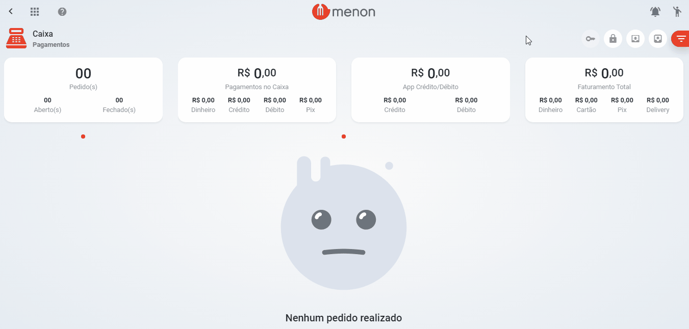

# Reforço de Caixa

* Na tela do "**CAIXA**", com o caixa aberto, clique no botão .png>) para realizar a **reforço**;
* Preencha os dados, depois clique em "**SALVAR**";

.png>)


Ao finalizar a operação, será impresso o comprovante no caixa.

