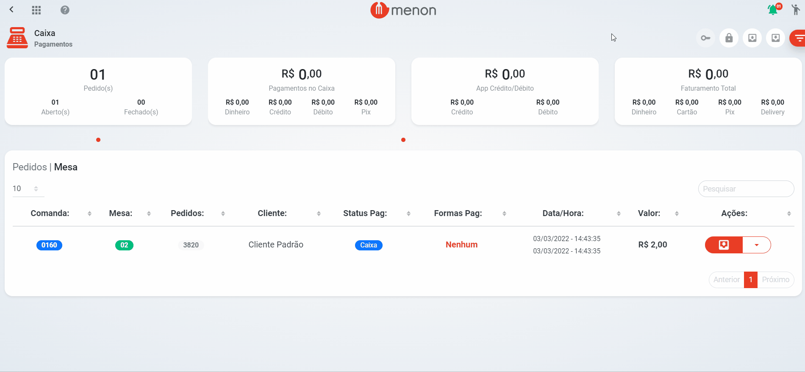

# Sangria

* Na tela do "**CAIXA**", com o caixa aberto, clique no botão .png>) para realizar a **sangria**;
* Preencha os dados, depois clique em "**SALVAR**";


Caso o usuário não possua permissão para realizar a sangria, será necessário inserir o **e-mail** e **senha** do gerente para processar a transação.

