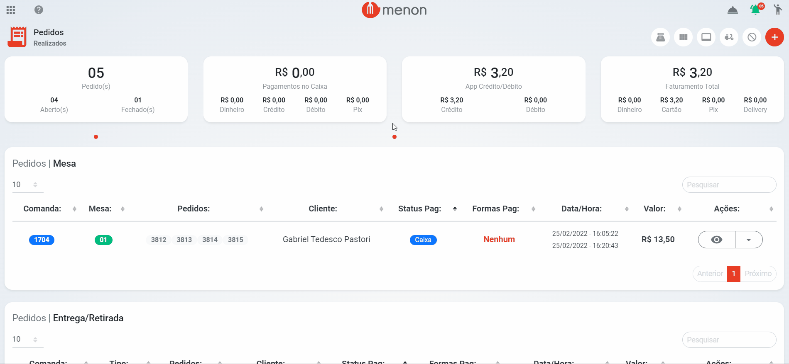

# Gestor de Entregas

* Para acessar o gestor de entregas, clique no botão  (1).png>) na tela de pedidos;

* No gerenciador de entregas, selecione o(s) pedido(s) que serão entregues;
* Após **selecionar** o(s) pedido(s), clique em **imprimir** rota para gerar o QR code;


A entrega é responsabilidade do estabelecimento.

