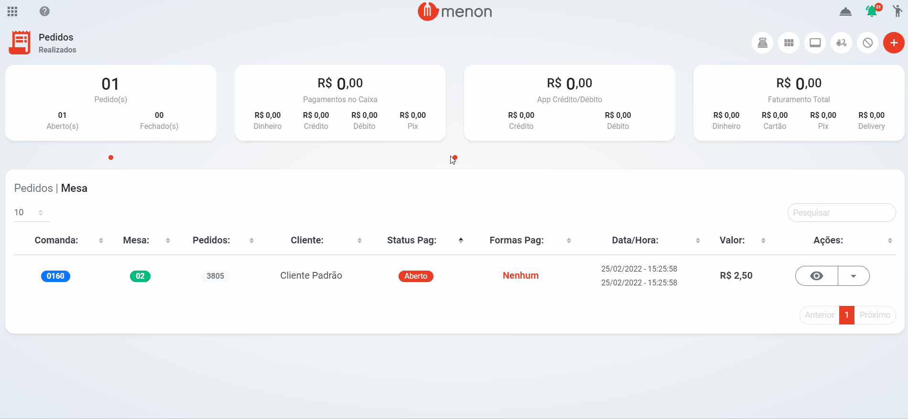
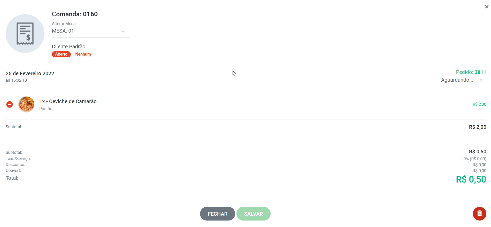
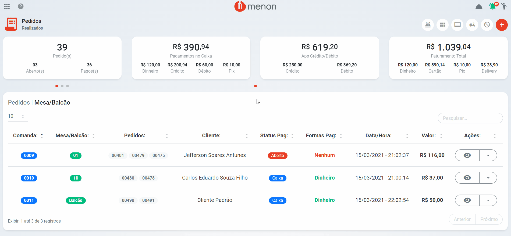

# Pedidos Cancelados

* Para **cancelar** um pedido, entre na tela dos "**PEDIDOS**";
* Selecione o pedido desejado, no campo esquerdo clique em  (1).png>) para **cancelar** e **editar;**

* Com a comanda aberta, é possível **editar** e **cancelar** o(s) item(s) desejados;
* Clique no botão de subtrair  (1).png>), para **REMOVER** o(s) item(s) selecionado(s);

.gif>)

* Clique no botão da lixeira (1).png>), para **CANCELAR** o pedido;

* Para visualizar o(s) item(s) cancelados, clique no botão  (1) (1).png>);

