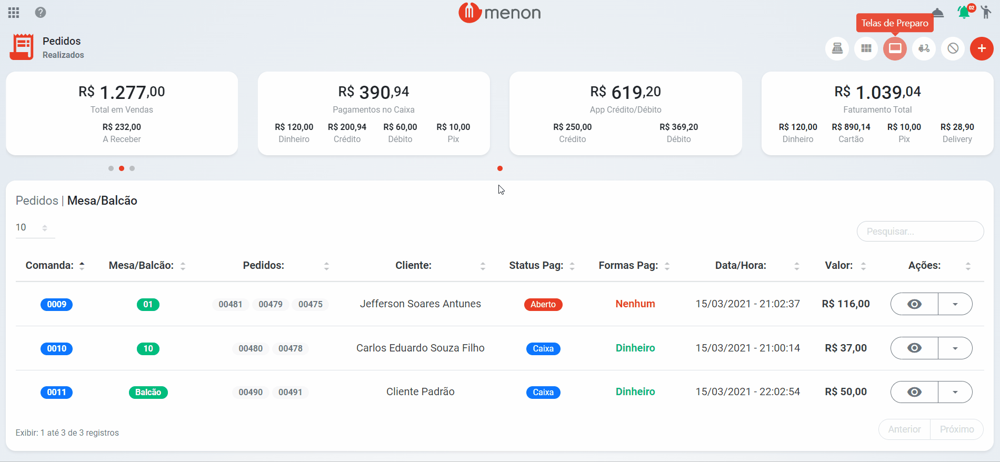

# Telas de Preparo

* Para visualizar a tela de preparo, clique no botão .png>);

* Selecione o setor desejado, clique nos botões: **COZINHA**, **BAR**, **COPA**;
* Na tela de preparo selecionada, irão aparecer os pedidos e o **status** do pedido: **PREPARAR**, **FINALIZAR**, **ENTREGUE**, respectivamente;

* Para **reimprimir** a comanda clique no botão  .png>).


Ao selecionar a opção de **reimprimir**, o pedido é impresso novamente em **todos** os setores percorridos.

